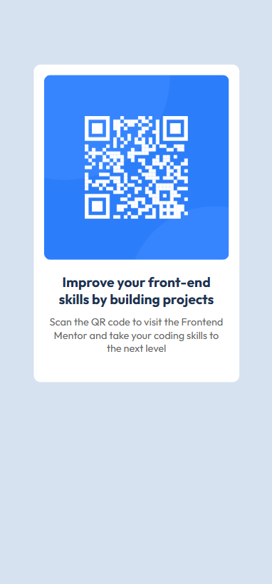

# Frontend Mentor - QR code component solution

This is a solution to the [QR code component challenge on Frontend Mentor](https://www.frontendmentor.io/challenges/qr-code-component-iux_sIO_H). Frontend Mentor challenges help you improve your coding skills by building realistic projects.

## Table of contents

- [Overview](#overview)
  - [Screenshot](#screenshot)
  - [Links](#links)
- [My process](#my-process)
  - [Built with](#built-with)
  - [What I learned](#what-i-learned)
  - [Continued development](#continued-development)
  - [Useful resources](#useful-resources)
- [Author](#author)
- [Acknowledgments](#acknowledgments)

**Note: Delete this note and update the table of contents based on what sections you keep.**

## Overview

### Screenshot

**Mobile view:**


**Desktop view:**


### Links

- Solution URL:
  (https://github.com/agudu50/QR-Code-Challenge)
- Live Site URL:
  (https://qr-code-challen.netlify.app/)

## My process

### Built with

- Semantic HTML5 markup
- CSS custom properties
- Flexbox
- CSS Grid
- Mobile-first workflow

### What I learned

Trying my hands so this challenge has broaden on my mind, at some point I felt like giving but stood firm and finised hard a big thnanks to @frontendMentor

To see how you can add code snippets, see below:

```html
<h1>Some HTML code I'm proud of</h1>
<p>Building your skills with FrontendMentor</p>
```

```css
.card-container {
  color: color: hsl(218, 44%, 22%);
}
```

```js
const proudOfThisFunc = () => {
  console.log("Kudos to myself🎉");
};
```

### Continued development

I want to focus on modern framework and libraries like react, vue, next js and more.

### Useful resources

- [resource 1](hhttps://www.frontendmentor.io/home) - This helped me for for completing this changelleng reason. I really liked this pattern and will use it going forward.
- [resource 2](https://www.w3schools.com/html/) - This is an amazing article which helped me finally understand HTML and CSS. I'd recommend it to anyone still learning this concept.

## Author

- Website - [Add your name here](https://www.your-site.com)
- Frontend Mentor - [@agudu50](https://www.frontendmentor.io/profile/agudu50)
- Twitter - [@trenchkhid008](https://www.twitter.com/trenchkhid08)

## Acknowledgments

I have always wanted to try my hand at a real-world challenge, and a big thanks to @FrontendMentor for giving me such an opportunity. Trying my hand at this challenge has helped me build upon my skills but not that much, and I am hoping I will face a bigger challenge next.
